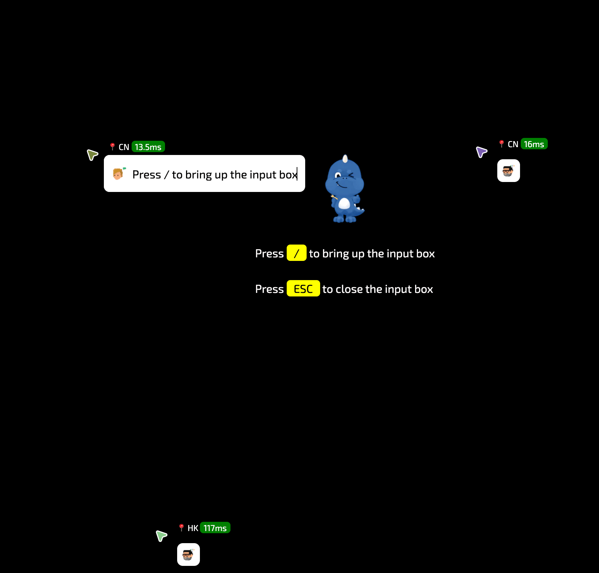

# @yomo/react-cursor-chat

## Introduction

A react component for cursor chat

-   Press `/` to bring up the input box
-   Press `ESC` to close the input box



## Quick Start

### Installation

```
$ npm i --save @yomo/react-cursor-chat
```

#### How do I get a `presenceAuth` token?

If you build your application using next.js, then you can use [API Routes](https://nextjs.org/docs/api-routes/introduction) to get the access token.
For example, the following API route `pages/api/auth.js` returns a json response with a status code of 200:

```js
export default async function handler(req, res) {
    if (req.method === 'GET') {
        const response = await fetch('https://presence.yomo.dev/api/v1/auth', {
            method: 'POST',
            headers: {
                'Content-Type': 'application/json',
            },
            body: JSON.stringify({
                app_id: process.env.PRESENCE_APP_ID,
                app_secret: process.env.PRESENCE_APP_SECRET,
            }),
        });
        const data = await response.json();
        res.status(200).json(data.data);
    } else {
        // Handle any other HTTP method
    }
}
```

Response data:

```json
{
    "token": "eyJhbGciOiJIUzI1..."
}
```

#### Importing the CursorChat component

```jsx
import React from 'react';
import CursorChat from '@yomo/react-cursor-chat';
import '@yomo/react-cursor-chat/dist/cursor-chat.min.css';

// `wss://presence.yomo.dev` is YoMo's demo service
<CursorChat
    presenceURL="wss://presence.yomo.dev"
    presenceAuth={{
        // Certification Type
        type: 'token',
        // api for getting access token
        endpoint: '/api/auth',
    }}
    avatar="https://avatars.githubusercontent.com/u/67308985?s=200&v=4"
    theme="light"
/>;
```

-   `presenceURL: string`: to set the WebSocket service address.
-   `presenceAuth: { type: 'publickey' | 'token'; publicKey?: string; endpoint?: string; }`: to set `presencejs` service Auth
-   `avatar?: string`: to set avatar.
-   `name?: string`: to set name.
-   `theme?: 'light' | 'dark'`: The background color of the chat box, the default value is "dark".

#### Or use hooks and customize the components yourself:

```tsx
import React, { useMemo } from 'react';
import { useOnlineCursor, useRenderPosition } from '@yomo/react-cursor-chat';
import CursorIcon from './CursorIcon';

// You can customise the content of your own mouse block
const MeCursor = ({ cursor }) => {
    const refContainer = useRenderPosition(cursor);

    return useMemo(
        () => (
            <div className="cursor" ref={refContainer}>
                <CursorIcon color={cursor.color} />
                {cursor.name && <div>{cursor.name}</div>}
                {cursor.avatar && (
                    
                )}
            </div>
        ),
        []
    );
};

// You can customise what other people's mouse blocks can display
const OthersCursor = ({ cursor }) => {
    const refContainer = useRenderPosition(cursor);
    return (
        <div ref={refContainer} className="cursor">
            <CursorIcon color={cursor.color} />
            {cursor.name && <div>{cursor.name}</div>}
            {cursor.avatar && (
                
            )}
        </div>
    );
};

// Exporting your custom components
const YourComponent = ({ presenceURL, presenceAuth, name, avatar }) => {
    const { me, others } = useOnlineCursor({
        presenceURL,
        presenceAuth,
        name,
        avatar,
    });

    if (!me) {
        return null;
    }

    return (
        <div className="container">
            {others.map(item => (
                <OthersCursor key={item.id} cursor={item} />
            ))}
            <MeCursor cursor={me} />
        </div>
    );
};
```

## LICENSE

<a href="/LICENSE" target="_blank">
    
</a>
